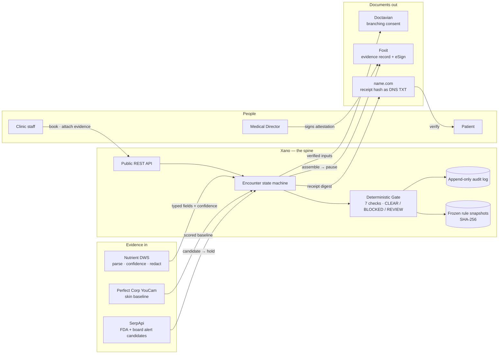
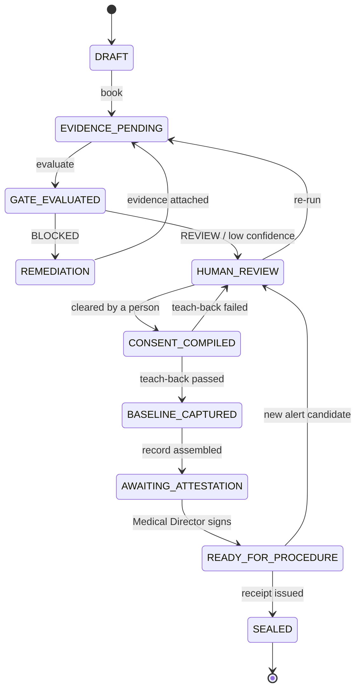

# Time-Out

**The surgical time-out, applied to cosmetic procedures.**

Before every incision, a surgical team pauses to confirm the patient, the site, and the procedure. In the study that introduced the WHO checklist, complications fell from 11.0% to 7.0% and inpatient deaths from 1.5% to 0.8% ([Haynes et al., NEJM 2009](https://pubmed.ncbi.nlm.nih.gov/19144931/)). Med spas — where neurotoxin and filler injections happen thousands of times a day — don't have one.

Time-Out is that pause. Before a cosmetic procedure can go ahead, it checks **who is performing it, what is being used, and whether the patient actually understood** — and refuses to produce a safety record when the evidence isn't there.

| | |
|---|---|
| **Live site** | https://timeout-prod-74602b-x6g0-xqak-a8ri.n7e.xano.io |
| **Public API** | `https://x6g0-xqak-a8ri.n7e.xano.io/api:before/v1` (no key needed for the demo) |
| **Scope** | Texas · neurotoxin · one hero path · **synthetic data only** |
| **Built for** | DevNetwork [API + Cloud + AI] Hackathon 2026 |

---

## Try it in 10 seconds

```bash
curl -X POST https://x6g0-xqak-a8ri.n7e.xano.io/api:before/v1/encounters/demo/evaluate
```

You'll get back `"verdict": "BLOCKED"` — a synthetic aesthetician was booked to inject neurotoxin in Texas with no delegation evidence on file. Every failed check comes with the exact facts that failed and a citation to the Texas rule.

That's the real evaluator running on the real backend. Nothing is mocked.

---

## What it does, in plain language

1. **A clinic books an encounter** — a patient, a procedure, and the person who'll perform it.
2. **Time-Out runs seven checks** against Texas rules and the evidence on file.
3. **Three possible answers:**
   - `CLEAR` — every check passed on an unambiguous rule
   - `BLOCKED` — a check failed; the encounter cannot proceed until a person fixes it
   - `REVIEW` — a rule is ambiguous or the evidence is uncertain; a named human decides
4. **If blocked**, the screen names the missing evidence, cites the rule, and offers a remedy. A person attaches what's missing and re-runs the check. **Nobody edits the database.**
5. **If cleared**, the patient completes a short teach-back (say the risks back in your own words — not a checkbox), a skin baseline is captured, consent is generated, and a Medical Director signs the attestation.
6. **The result is a safety receipt** — a record of exactly what was checked, frozen with the ruleset that was used, hashed, and published so the patient can verify it later.

If an FDA warning letter or a state board action lands *after* an encounter is ready, it goes back to human review. Ready is reversible.

---

## The seven checks

| Check | What it asks |
|---|---|
| `provider_license` | Is the licence active, in-state, and unexpired? |
| `authority_pathway` | May this person perform this procedure — directly, or under documented delegation? A job title alone is never an answer. |
| `delegation_and_supervision` | Is there a patient-specific order, a signed protocol, current BLS, and an available supervisor? |
| `preprocedure_assessment` | Was the required pre-procedure assessment recorded? |
| `product_lot` | Is the lot captured, and is it free of any confirmed alert? |
| `comprehension` | Did the patient pass a teach-back, versioned to this exact ruleset? |
| `board_status` | Any disciplinary finding? |

All seven run every time. Findings are collected, never short-circuited, so a person sees everything that's wrong at once.

---

## Architecture



**The rule that shapes everything:** the software never decides what's legal, and no model ever does arithmetic. Documents are read by models into typed fields with confidence scores. Every verdict comes from deterministic code over a cited rules table. Anything uncertain goes to a named human.

### Encounter state machine



Every transition writes an audit event. Retries are idempotent. `READY_FOR_PROCEDURE → HUMAN_REVIEW` is the edge that matters most: a live alert can reopen a prepared encounter.

---

## Where each sponsor does real work

| Sponsor | What it does here | Why nothing else would do |
|---|---|---|
| **Xano** | The entire backend: 15 tables, the state machine, the Gate, approvals, the audit log, the public API, and static hosting. | The whole product is a state machine with an audit trail. Xano *is* the system, not a database behind it. |
| **Nutrient DWS** | Parses credential, intake, and product documents into typed fields with **per-field confidence and page coordinates**. Semantic redaction before anything leaves the vault. | A field below the confidence floor routes to a named Medical Director, who sees the source page with the uncertain field boxed at the coordinates DWS returned, before the encounter can advance. The threshold lives in code, never in a prompt. |
| **SerpApi** | Live searches for FDA warning letters and Texas board actions. A hit becomes an **alert candidate** that moves a ready encounter back to human review. | Live data with a consequence — it changes the workflow. It never decides authenticity, discipline, or law; a person confirms or dismisses, and that's audited. |
| **Perfect Corp YouCam** | Standardized skin baseline: 12 scored concerns, an overall score, skin age, and overlay masks, captured before treatment. | An objective, repeatable pre-procedure record the patient keeps. A **baseline and communication aid — never a diagnosis.** |
| **name.com** | Search, availability, registration, and DNS. The receipt's SHA-256 is published as a **TXT record** the patient can look up. | Verification that doesn't require trusting our server. Stated limit: sandbox DNS doesn't propagate publicly, and a TXT record is mutable by its owner — a verification channel, not a notary. |
| **Doctavian** | One consent template that **branches** on procedure and authority pathway, **loops** over cited disclosures, and **calculates** only the non-clinical disclosure count. Patient and injector sign. | Consent varies by who's performing and why. Fifty static forms can't do that; one template with real logic can. Nothing uncited — no invented dose or cooling-off period — enters the document. |
| **Foxit** | An agent takes "assemble the safety record for encounter X", performs reversible assembly through the Foxit MCP server, then **stops** and hands the Medical Director attestation to eSign. | The pause at the irreversible boundary is the point. The agent does the reversible work; a licensed human takes the action that can't be undone. |

---

## Run it yourself

```bash
git clone https://github.com/usv240/time-out.git && cd time-out
python -m pip install -r requirements.txt
python -m before.seed         # write the synthetic cache
python -m before.verify       # run the whole hero path offline, print the receipt
python -m pytest tests -q     # 98 checks, offline
```

Everything above is offline. One more suite drives the **deployed** site in a real
browser against the **deployed** backend — the six attacks, the receipt, the
reproducibility check, and layout at phone and desktop widths:

```bash
python -m playwright install chromium
python -m tests.smoke_live                    # 48 checks against production
```

It exists because the offline suite cannot see a transport-layer rejection between
the browser and the Gate. Both were correct while the request between them was being
rejected, and every unit test still passed. CI runs it after each push and daily.

Everything above runs with **no network and no credentials**. To point it at live sponsor APIs, copy `.env.example` to `.env` and fill in the keys you have — each integration activates independently; the rest keep replaying cached responses.

Local console:

```bash
python -m before.app.server --offline
# open http://localhost:4173/
```

---

## Public API

Base: `https://x6g0-xqak-a8ri.n7e.xano.io/api:before/v1`

| Method | Path | What it does |
|---|---|---|
| `GET` | `/health` | Liveness + determination scope |
| `POST` | `/encounters/demo/evaluate` | One-click hero path on the seeded synthetic encounter |
| `POST` | `/encounters` | Create an encounter |
| `POST` | `/encounters/{id}/evidence` | Attach a typed evidence document (with confidence) |
| `POST` | `/encounters/{id}/evaluate` | Run the seven checks |
| `POST` | `/encounters/{id}/remediate` | Attach what was missing, as a named person |
| `POST` | `/encounters/{id}/rerun` | Re-evaluate after remediation |
| `GET` | `/encounters/{id}` | State, findings, and full audit history |

Every response carries `determination_scope: "Pre-procedure safety determination for human review"`. The API is synthetic-only and rejects common real-data patterns.

---

## What this is not

We'd rather you trust the parts that work.

- **It does not determine legality.** It produces a safety determination for a licensed human to review.
- **It does not certify** that a treatment is safe, that a product is authentic, or that an outcome will be good.
- **It does not replace professional judgement.** Every ambiguous call goes to a person, by design.
- **Teach-back isn't ours.** 5thPort, Clinical ink, and Datatrak ship comprehension checks. What we haven't found documented elsewhere is binding a scored teach-back to a whole-encounter hold with a versioned rule snapshot.
- **The receipt is a record, not a notary.** The verification domain runs in a sandbox that doesn't propagate publicly, and DNS records are mutable by their owner.
- **Texas neurotoxin only.** Other states are a rule-authoring exercise, not a claim we've already made.
- **Synthetic everything.** No real clinic, patient, face, licence, lot, or document appears anywhere in this project.

---

## Why this problem

- ~13,000 US med spas by end of 2026, with complication rates measurably higher than physician offices — *Aesthetic Surgery Journal*, 2026
- Of 20 med spa malpractice cases reviewed, 13 ended in plaintiff verdicts averaging near $2.5M. The leading causes: **absent informed consent, failure to communicate risk, and liability for the actions of delegates** — Westlaw review, 2006–2024
- In April 2026 the FDA warned a Texas med spa that could not reconcile the authentic Botox it purchased against what it recorded administering
- Interactive teach-back materially outperforms written consent for understanding — systematic review, 2020

Every one of those is a paperwork failure that happens *before* the needle — the only moment it's still cheap to fix.

Primary-source basis for the Texas ruleset: [`research/texas-neurotoxin-authority.md`](research/texas-neurotoxin-authority.md).

---

## Status — 27 Aug 2026

| Area | State |
|---|---|
| Gate, state machine, audit log, receipts | ✅ Live on Xano |
| Public site + API | ✅ Live — `/try` runs the Gate live on Xano, lets you **break it yourself** (six real attacks, audited), and shows the audit log; `/receipt` is the patient's record; `/how-it-works` re-hashes a live verdict in your browser |
| Nutrient · SerpApi · name.com · Perfect Corp | ✅ Live calls verified, responses cached for offline replay |
| Foxit | ✅ Agent live end to end: prompt → MCP assembly → pause → human eSign, **signed** (envelope 35704700, EXECUTED) → outcome read back GET-only. Two MCP field-mapping bugs documented and routed via REST |
| Doctavian | ⚠️ Auth, data source, solution, template + data upload live. Generation blocked on the demo account's Google Drive delivery — we declined to grant full Drive access. Resolution requested from Doctavian. |
| Tests | ✅ 94 offline + 48 live-browser smoke checks · CI green |

---

## Repository map

```
before/app/        service layer, state machine, sponsor adapters, live clients
before/site/       the public site (static, hosted on Xano)
before/doctavian/  the consent template and the document Doctavian generated
shared/gate/       the deterministic seven-check evaluator (pure, no network)
fixtures/          synthetic clinic, providers, encounters, documents, face
xano-workspace/    the deployed Xano schema, functions, and API — as code
research/          primary-source basis for the Texas ruleset
tests/             98 offline checks + a live-browser smoke suite
```

The Python package is named `before/` for historical reasons; the product is Time-Out.
